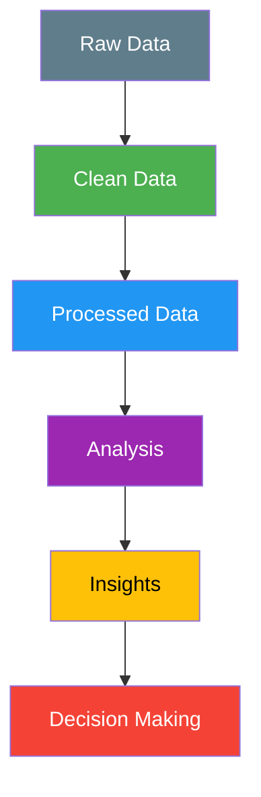

# 📘 NumPy Practice Assignment — Complete Data Analytic & Data Science Guide

<p align="center">
  
</p>

<p align="center">
<b>End-to-End NumPy Workflow for Data Analysis, Numerical Computing & Insights</b><br>
From <b>data collection → cleaning → modeling → computation → visualization → insights</b>
</p>

---

# 🚀 Repository Overview

```txt
Domain            : Data Analytics / Numerical Computing
Language          : Python (NumPy)
Project Type      : Structured Learning + Practical Implementation
Skill Level       : Beginner → Intermediate
Use Case          : Data Processing | Numerical Analysis | EDA | Computation
Outcome           : Strong Foundation in NumPy & Analytical Thinking
```

---

# 🔥 Repository Value Proposition

This repository is designed as a **complete NumPy learning ecosystem**, focusing on:

✔ Concept-first learning approach
✔ Hands-on numerical problem solving
✔ Structured progression from basics to advanced operations
✔ Strong focus on **array-based computation**
✔ Real-world data handling techniques

---

# 🧠 End-to-End Analytics Workflow

📥 **Collect** → 🧹 **Clean** → 🔗 **Model** → 🧮 **Calculate** → 📊 **Visualize** → 🎛️ **Interact** → 🎯 **Analyze** → 💡 **Insight** → 🚀 **Decision**

---

# 📚 Detailed Learning Modules

## 🔹 1. NumPy Fundamentals

* Arrays vs Lists
* Creating Arrays (1D, 2D, ND)
* Data Types & Memory Efficiency
* Indexing & Slicing

---

## 🔹 2. Array Operations

* Mathematical Operations
* Broadcasting
* Vectorization
* Element-wise Computation

---

## 🔹 3. Data Cleaning with NumPy

* Handling Missing Values (NaN)
* Filtering & Conditional Selection
* Removing Outliers
* Data Transformation

---

## 🔹 4. Data Modeling

* Reshaping Arrays
* Stacking & Splitting
* Structuring Data Efficiently

---

## 🔹 5. Numerical Computation

* Aggregations (sum, mean, std)
* Linear Algebra Basics
* Matrix Operations
* Statistical Computations

---

## 🔹 6. Data Visualization (Integration)

* Preparing Data for Visualization
* Integration with Matplotlib
* Plot-ready Data Structuring

---

## 🔹 7. Interactive Data Handling

* Iterative Computation
* Dynamic Data Manipulation
* Real-time Data Experiments

---

## 🔹 8. Data Analysis

* Pattern Recognition
* Trend Analysis
* Data Comparison
* Logical Reasoning with Arrays

---

## 🔹 9. Real-World Applications

* Dataset preprocessing
* Performance optimization
* Analytical pipelines
* Foundation for Machine Learning

---

# 📊 Key Skills Developed

| Skill Area           | Capability                               |
| -------------------- | ---------------------------------------- |
| Data Cleaning        | Handle missing & inconsistent data       |
| Array Manipulation   | Efficient numerical operations           |
| Computational Skills | Fast vectorized calculations             |
| Data Structuring     | Organize data using NumPy arrays         |
| Problem Solving      | Convert logic into optimized computation |

---

# 💡 Key Insights You Will Gain

✔ How to replace loops with vectorized operations
✔ How to optimize computations using NumPy
✔ How to structure large datasets efficiently
✔ How to prepare data for analysis & visualization
✔ How to build strong numerical foundations

---

# 🛠 Tools & Technologies

| Tool       | Role                         |
| ---------- | ---------------------------- |
| Python     | Core Programming Language    |
| NumPy      | Numerical Computation Engine |
| Matplotlib | Visualization                |
| Jupyter    | Development Environment      |

---

# 📁 Repository Structure

```txt
📁 Numpy_Practice_Assignment
│
├── 📘 Concept Notes
├── 💻 Practice Code
├── 📊 Datasets (if any)
├── 🖼 Thubnail.png
└── 📄 README.md
```

---

# 🎯 Learning Outcomes

After completing this repository, you will be able to:

✔ Perform numerical computations efficiently using NumPy

✔ Clean and transform raw datasets

✔ Apply array-based problem solving

✔ Prepare data for visualization & ML

✔ Build optimized analytical workflows

---
# 🔁 🧠 Analytics Workflow (Visual Flow)


---

# 📊 📌 NumPy Skills Showcase (Practical Examples)

## 🔹 1. Array Creation

```python
import numpy as np

arr = np.array([1, 2, 3, 4])
matrix = np.array([[1, 2], [3, 4]])

print(arr)
print(matrix)
```

---

## 🔹 2. Vectorized Computation

```python
arr = np.array([10, 20, 30])

# Faster than loops
result = arr * 2
print(result)
```

---

## 🔹 3. Data Cleaning

```python
data = np.array([1, 2, np.nan, 4])

# Remove missing values
clean_data = data[~np.isnan(data)]
print(clean_data)
```

---

## 🔹 4. Statistical Analysis

```python
data = np.array([10, 20, 30, 40])

print("Mean:", np.mean(data))
print("Std:", np.std(data))
```

---

## 🔹 5. Reshaping & Modeling

```python
arr = np.arange(8)

reshaped = arr.reshape(2, 4)
print(reshaped)
```

---

# 📊 📈 Skills Mapping Table

| Stage     | NumPy Capability         | Example Skill          |
| --------- | ------------------------ | ---------------------- |
| Collect   | Data Input               | Load datasets          |
| Clean     | NaN Handling             | Remove missing values  |
| Model     | Array Structuring        | Reshape, stack         |
| Calculate | Vectorized Operations    | Fast computation       |
| Visualize | Data Prep for Matplotlib | Plot-ready arrays      |
| Interact  | Dynamic Indexing         | Conditional filtering  |
| Analyze   | Aggregations             | Mean, std, correlation |
| Insight   | Pattern Detection        | Trends in arrays       |
| Decision  | Logical Conclusions      | Data-driven outputs    |

---

# 🧠 🚀 Advanced Example (Mini Pipeline)

```python
import numpy as np

# 📥 Collect
data = np.array([10, 20, np.nan, 40, 50])

# 🧹 Clean
data = data[~np.isnan(data)]

# 🧮 Calculate
mean = np.mean(data)

# 🎯 Analyze
above_mean = data[data > mean]

# 💡 Insight
print("Mean:", mean)
print("Above Mean:", above_mean)
```

---

# 🎨 💡 Visual Insight Concept



---

# 🏆 💼 What This Shows Recruiters

✔ You understand **end-to-end data workflows**
✔ You can write **efficient NumPy code**
✔ You apply **real analytical thinking**
✔ You structure projects professionally
✔ You combine **theory + implementation**

---

# 🧭 Who Is This For?

✔ Beginners learning Python for Data Analytics

✔ Students practicing NumPy

✔ Data Analysts building strong foundations

✔ Aspiring Data Scientists

✔ Anyone interested in numerical computing

---

# 🚀 Business / Career Impact

This repository helps you:

✔ Strengthen core data skills
✔ Improve computational efficiency
✔ Build portfolio-ready projects
✔ Prepare for Data Analyst roles
✔ Transition into Data Science

---

# 📊 Summary

This repository transforms **raw data into computational insights**, enabling learners to move from:

📉 Data → 🧮 Computation → 📊 Visualization → 💡 Insights → 🚀 Decisions

---

# 🧑‍💻 Author

**Ashwin Ananta Panbude**
Data Analyst | Python | NumPy | Power BI | Tableau

<p align="center">
  <a href="https://github.com/Ashwin18-Offcl">
    
  </a>
  <a href="https://bit.ly/49pSuZJ">
    
  </a>
</p>

---

